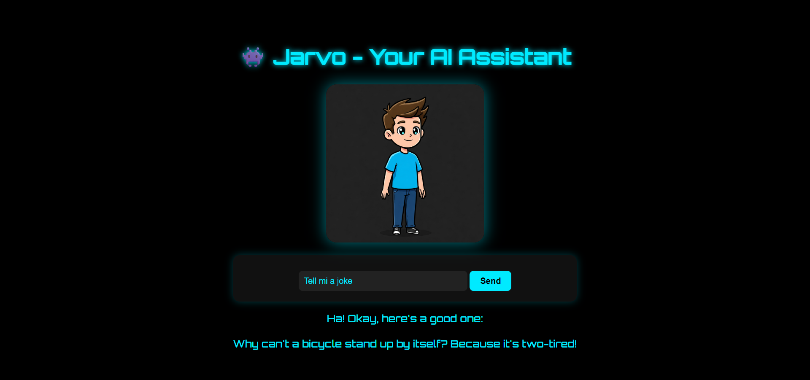

# 🤖 Jarvo - Your AI Assistant

Jarvo is a Django-based AI chatbot application that simulates a conversational assistant using the OpenAI GPT model. It allows users to interact via text (and optionally voice), providing intelligent and context-aware responses.

---

## 🌟 Objective

Develop an AI-powered assistant that mimics human-like conversation using OpenAI's GPT model, integrated within a Django web application. The app allows user interaction through a browser-based interface, with optional speech-to-text and text-to-speech support.

---

## 🧾 Steps Performed

1. Created Django project structure with modular design
2. Integrated OpenAI's API for generating AI responses
3. Implemented SpeechRecognition for voice input
4. Added pyttsx3 for converting text responses to speech
5. Designed clean frontend using HTML & CSS
6. Connected UI with backend using Django views and templates
7. Parsed input/output to simulate real-time assistant behavior

---

## 🛠️ Tools & Technologies Used

- **Python**
- **Django**
- **OpenAI API**
- **SpeechRecognition**
- **pyttsx3**
- **PyAudio**
- **HTML / CSS**

---

## ✅ Outcome

- Users can type or speak queries to the assistant
- Jarvo generates relevant responses using OpenAI's GPT
- Optionally responds with voice output for a more interactive experience
- Provides a lightweight, local AI assistant experience

---

## 📷 Screenshots

**Jarvo Home Interface**

